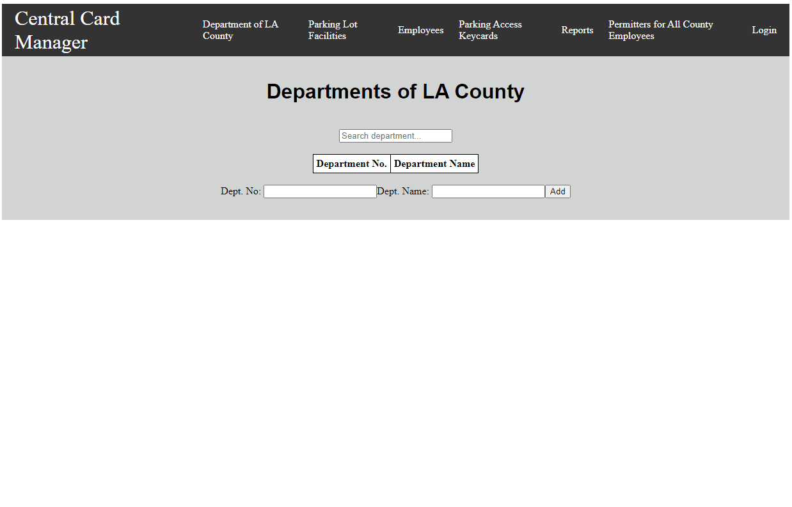
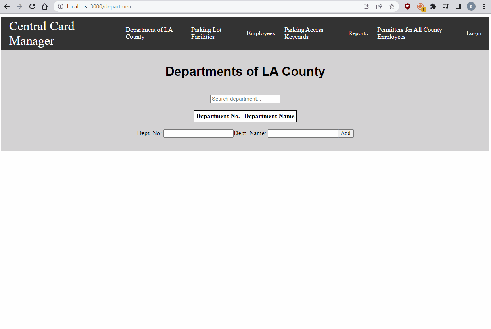
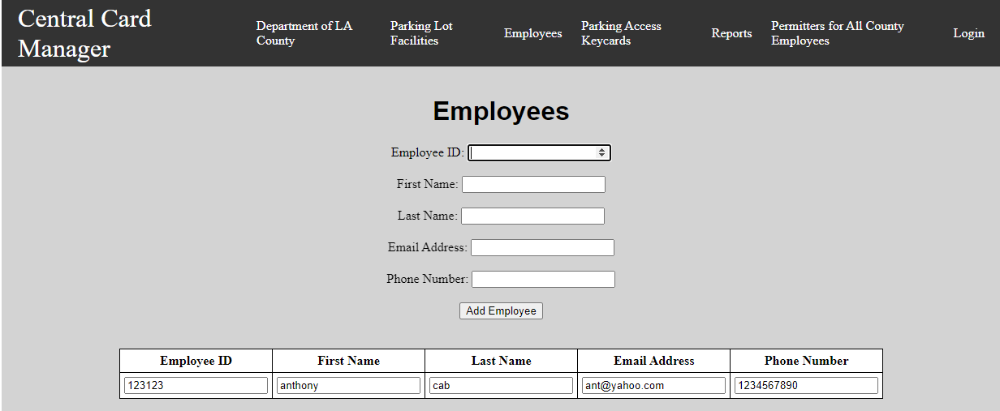
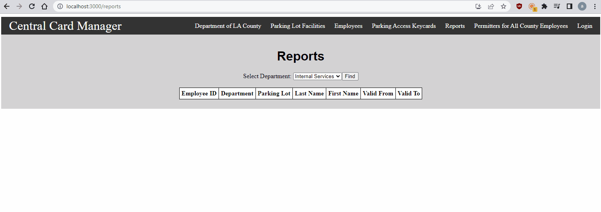

# Employee Access Parking Control System

## Project Description

This is a web-based Parking Control System that creates employee parking access keycards. 

## Table Of Contents:

* [Introduction](#introduction)
* [The Team](#team)
* [Getting Started](#gettingstarted)
* [Features](#features)

 

## Introduction  

Development for this project started in the Summer of 2022 for the CS Summer Project program at CSUF. This project uses React for the front-end, Node/Express for the back-end, and SQLite for database integration. It implements the Model-View-Controller (MVC) pattern to separate the application logic and improve code maintainability. The MVC pattern separates the application logic into three main components: the Model, the View, and the Controller. The Model represents the data and the business logic, the View represents the user interface, and the Controller handles the communication between the Model and the View. This separation allows for more modular and maintainable code, as well as easier testing and debugging.

 

## The Team  

* Anthony Cabacungan <https://github.com/anthony-cabacungan> 
* Diamond Ly <https://github.com/diamondly> 
* Samee Rauf <https://github.com/sameerauf1>

 

## Getting Started

### `Windows`

1. Install [Node.js](https://nodejs.org/en/download/)
2. Open the project terminal
3. Install necessary indepndencies using '`npm i`' in the root folder
4. Install additional packages & libraries: `config`, `morg`, and `dotenv`
5. In the root folder, start the local host using '`npm start`', the front-end server will run on http://localhost:3000/
6. In the /src/api folder, start the back end using '`node server.js`', the back-end server will run on http://localhost:4000/

### `Mac/Linux`
1. Install [Node.js](https://nodejs.org/en/download/)
2. Open the project terminal
3. Install necessary indepndencies using '`sudo npm i`' in the root folder
4. Install additional packages & libraries: `config`, `morg`, and `dotenv`
5. In the root folder, start the local host using '`sudo npm start`', the front-end server will run on http://localhost:3000/
6. In the /src/api folder, start the back end using '`node server.js`', the back-end server will run on http://localhost:4000/

## Features 

* Search functionality for department number/name and parking lot number/name

 

  

* Ability to add, delete, and edit departments and parking lot database

 

  

* Add, save, and display employee and keycard information

 

  

* Add, save, and display keycard information and display in reports page

 

  

* Implementation of the MVC pattern for improved code maintainability and separation of concerns.
